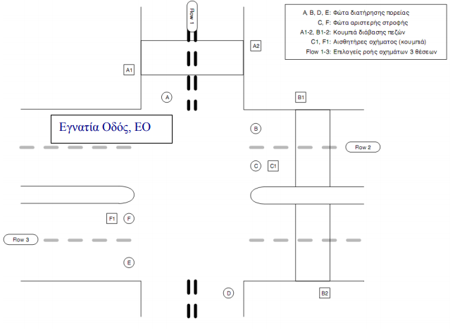

# AVR-traffic-lights
🚦 AVR project for handling traffic light using interrupts.

  

----
## 🏀 Usage
Instructions to run this repo using AVR Studio 4 and ATMEGA16 microcontroller:

1. Create New Project
2. Choose Atmel **AVR Assembler** project type and set the same of .asm file
3. Copy & Paste the content of main.asm file at your main .asm file
4. Press **F7** to build the project 
5. Select AVR Programmer menu and choose **STK500** platform and the appropriate port (usually **COM1**)
6. Click connect and select the generated **.hex** on
